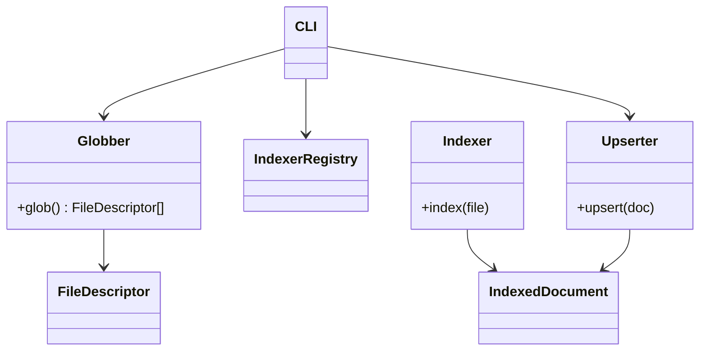
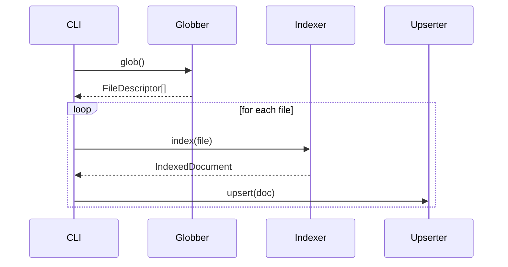

# PKMS Abstract Interfaces v0.1

## Status

Draft

## Scope

This document defines **abstract interfaces and responsibility boundaries** for the PKMS system.

It focuses on **contracts**, not implementations.

* No concrete storage engines are assumed
* No UI framework is assumed
* Interfaces are written in *Python-like pseudocode* for clarity

This document serves as:

* A design reference for developers
* A stable contract boundary for future refactors
* The basis for class diagrams and sequence diagrams

---

## High-Level Architecture

PKMS is designed as a **pipeline of independent components**:

```
Globber → Indexer → Upserter → Database
```

Each component:

* Has a single responsibility
* Communicates only via explicit data models
* Is replaceable without affecting others

---

## Core Concepts

### FileDescriptor

Represents a discovered file **before content processing**.

```python
class FileDescriptor:
    file_uri: str
    file_extension: str
    file_size: int
    file_created_datetime: datetime
    file_modified_datetime: datetime
```

**Notes**:

* MUST NOT include extracted content
* MUST be cheap to construct
* MUST be stable across repeated glob operations

---

### IndexedDocument

Represents the **output of indexing** and the **input to persistence**.

```python
class IndexedDocument:
    # Identity
    file_id: str
    file_uid: str | None

    # Location
    file_uri: str
    file_extension: str
    file_size: int

    # Integrity
    file_hash_sha256: str

    # Classification
    file_kind: str  # 'snapshot' | 'editable'

    # Metadata
    title: str
    importance: int
    origin_uri: str | None

    # Time
    file_created_datetime: datetime
    file_modified_datetime: datetime

    # Content
    text: str | None
    extra: dict | None
```

**Notes**:

* Treated as a **stable contract boundary** (see ADR-0003)
* Does not depend on database schema details

---

## Abstract Interfaces

### Globber

#### Responsibility

* Discover candidate files under a base path
* Produce `FileDescriptor` objects

#### Interface

```python
class Globber(ABC):
    @abstractmethod
    def glob(self) -> list[FileDescriptor]:
        pass
```

#### Constraints

* MUST NOT read file content
* MUST NOT modify filesystem
* MUST NOT perform indexing

---

### Indexer

#### Responsibility

* Convert a file into structured indexed data
* Handle file-type-specific logic

#### Interface

```python
class Indexer(ABC):
    @abstractmethod
    def index(self, file: FileDescriptor) -> IndexedDocument:
        pass
```

#### Constraints

* MUST NOT perform database writes
* MAY use external tools (ffmpeg, whisper, etc.)
* SHOULD be deterministic given the same input

---

### IndexerBuilder / Registry

#### Responsibility

* Resolve indexer implementations from configuration
* Manage indexer lifecycle and caching

```python
class IndexerRegistry:
    def get_indexer(self, file_extension: str) -> Indexer:
        pass
```

---

### Upserter

#### Responsibility

* Persist `IndexedDocument` into storage
* Handle insert/update semantics

#### Interface

```python
class Upserter(ABC):
    @abstractmethod
    def upsert(self, doc: IndexedDocument) -> None:
        pass
```

#### Constraints

* MUST enforce identity rules (`file_id`, `file_uid`)
* MUST handle partial updates safely

---

### CLI

#### Responsibility

* Orchestrate the indexing pipeline
* Load configuration
* Handle user input and flags

```python
class CLI:
    def run(self, config_path: str) -> None:
        pass
```

---

## Mermaid Diagrams

### Class Diagram



---

### Sequence Diagram



---

## Design Principles

* Explicit contracts over implicit behavior
* Metadata != Identity
* Indexing is pure; persistence is side-effectful
* Prefer extensibility over premature optimization

---

## Future Extensions (Non-Goals for v0.1)

* Searcher interface
* URI handler / router
* Version graph / content DAG
* Distributed replicas

---

## References

* ADR-0003: Treat IndexedDocument as a Stable Contract Boundary
* ADR-0009: ADR Filename Convention
* ADR-0010: ADR Document Title Convention
