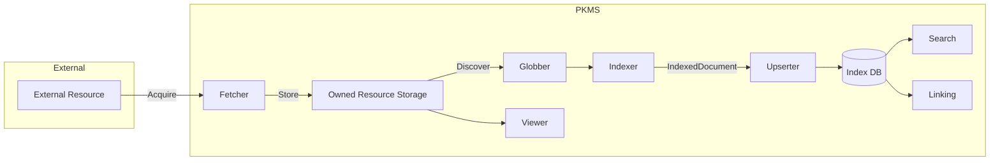
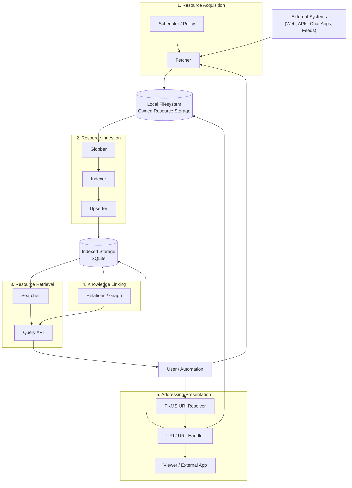

# PKMS System Diagram (Mermaid)

## Table of Contents

- [PKMS System Diagram (Mermaid)](#pkms-system-diagram-mermaid)
  - [Table of Contents](#table-of-contents)
  - [Overview Diagram](#overview-diagram)
  - [Diagram](#diagram)
  - [How to Read This Diagram](#how-to-read-this-diagram)
    - [Vertical Flow = Lifecycle](#vertical-flow--lifecycle)
    - [Horizontal Separation = Responsibility](#horizontal-separation--responsibility)
  - [Key Design Insights Captured](#key-design-insights-captured)
    - [1. Filesystem as a Hard Boundary](#1-filesystem-as-a-hard-boundary)
    - [2. IndexedDocument Boundary](#2-indexeddocument-boundary)
    - [3. Knowledge Linking Is Orthogonal](#3-knowledge-linking-is-orthogonal)
    - [4. Addressing ≠ Retrieval](#4-addressing--retrieval)

## Overview Diagram

## Diagram

> This diagram illustrates the **conceptual system architecture** of PKMS, focusing on responsibilities and boundaries rather than implementation details.

## How to Read This Diagram

### Vertical Flow = Lifecycle

- Top → Bottom represents the **resource lifecycle**
- Acquisition happens before Ingestion
- Ingestion produces Indexed Storage
- Retrieval and Linking are read-only consumers

### Horizontal Separation = Responsibility

Each subgraph is a **conceptual capability boundary**, not a module boundary.

## Key Design Insights Captured

### 1\. Filesystem as a Hard Boundary

- Acquisition writes to FS
- Ingestion reads from FS
- No hidden backchannels

### 2\. IndexedDocument Boundary

- Everything between Indexer → Upserter → DB operates on structured contracts
- No direct FS access after ingestion

### 3\. Knowledge Linking Is Orthogonal

- Graph does not depend on file layout
- Relations survive file moves / renames

### 4\. Addressing ≠ Retrieval

- URI resolution may touch FS or DB
- Search never opens files
- Viewers never index content
