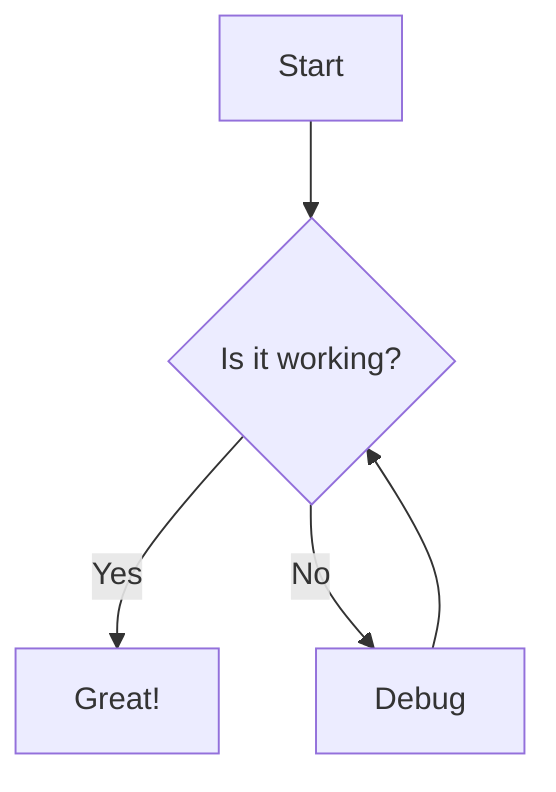

# Sample Markdown Document

This document demonstrates the converter's features.

## Math Support (KaTeX)

Inline math: The quadratic formula is $x = \frac{-b \pm \sqrt{b^2-4ac}}{2a}$.

Display math:

$$
\int_{-\infty}^{\infty} e^{-x^2} dx = \sqrt{\pi}
$$

## Mermaid Diagrams



## External Links (Redirection)

Here are some external links that will be redirected:

- [example.com](https://example.com)
- [example.org](https://example.org)
- [example.net](https://example.net)

## Other Features

### External Images


### Code Block

```python
def hello_world():
    print("Hello, World!")
```

### Table

| Feature | Supported |
|---------|-----------|
| KaTeX   | ✅        |
| Mermaid | ✅        |
| Links   | ✅        |

### Blockquote

> This is a blockquote.
> It can span multiple lines.

### Strikethrough

This text is ~~strikethrough~~.
